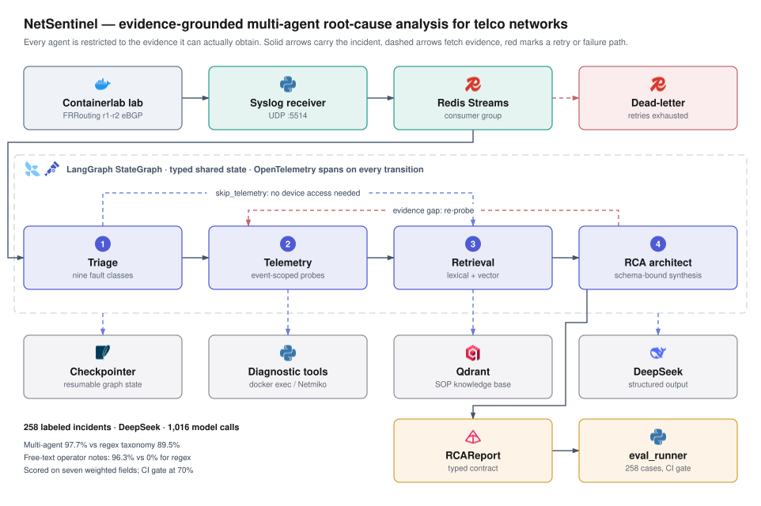

<div align="center">

# NetSentinel

**Four agents turn a raw router alarm into a schema-validated root-cause report —
and the repo ships the experiment that shows where they beat a regex.**


</div>



Triage classifies the fault, Telemetry collects only the CLI output that fault
calls for, Retrieval pulls the matching runbook, and the RCA architect
synthesises all three into ranked remediation steps under a Pydantic contract.
Every agent is restricted to the evidence it can actually obtain, and the
retrieval and telemetry it produces are scored as separate fields.

---

## Results

258 labeled incidents · DeepSeek `deepseek-flash` · 1,016 successful model calls ·
seven-field weighted rubric
([full report](lab/eval_reports/ablation_deepseek_20260915T004445Z.json)).

| Method | Evidence it may use | Pass rate | Weighted score | Free-text alarms |
|:---|:---|:---|:---|:---|
| `rule_only` | Syslog only, no model | 231/258 · 89.5% | 92.7% | 0/27 |
| `single_agent` | One model call, no tools | 0/258 · 0% | 71.6% | 0/27 |
| `rag_only` | Syslog + SOP retrieval | 231/258 · 89.5% | 86.6% | 0/27 |
| **`multi_agent`** | **+ event-scoped CLI + hybrid RAG** | **252/258 · 97.7%** | **99.2%** | **26/27** |

**Pattern matching is a strong baseline, so the interesting question is where it
breaks.** On alarms carrying vendor keywords (`%BGP-5-ADJCHANGE`,
`LINK-3-UPDOWN`) a Drain/regex taxonomy reaches 89.5% with no model at all.

**It breaks when the keywords go away.** 27 cases are the same faults written
the way an on-call engineer writes them — *"customer says the Jakarta link keeps
dropping, saw the session bounce four times"*. The regex baseline scores 0/27
([evidence](lab/eval_reports/eval_20260915T210445Z.json)); the pipeline scores
26/27. That column is the argument for LLM triage.

**Tools decide the score, not reasoning.** `single_agent` passes nothing: with
no retrieval and no telemetry it forfeits 25% of the rubric and caps at 0.75
against a 0.85 threshold. Its 71.6% shows it classifies faults competently and
simply cannot produce evidence. Retrieval recovers the runbook score, and live
CLI collection closes the rest.

### Scoring rubric

| Field | Weight | Checks |
|:---|:---|:---|
| `event_type` | 0.25 | Fault class matches the label |
| `severity` | 0.10 | Follows the platform's ITU-T X.733-style convention |
| `nodes` | 0.10 | Affected devices identified |
| `rag_documents` | 0.15 | A relevant runbook was actually retrieved |
| `rca_contract` | 0.15 | Report validates against the Pydantic schema |
| `rca_keywords` | 0.15 | Root cause names the failing subsystem |
| `telemetry_evidence` | 0.10 | Live CLI output backs the conclusion |

A case passes when `event_type` is right, the weighted score is at least 0.85,
and the retrieval, contract and keyword fields are all correct. `eval_runner`
exits non-zero below 70%, which makes it usable as a CI gate.

Every report records `llm_calls`. Agents fall back to heuristics when a model
call fails, so a report showing `{"ok": 0}` was scored by regex — the counter is
what separates a real model run from an offline one.

---

## Architecture

| Agent | Responsibility |
|:---|:---|
| **Triage** | Classifies the alarm into one of nine fault types, assigns severity, extracts device and peer, picks the route |
| **Telemetry** | Runs only the probes the fault needs — `show ip bgp summary` for a session drop, interface counters for a link failure — over `docker exec` or Netmiko |
| **RAG** | Hybrid lexical + vector retrieval across SOP markdown and historical BGP incidents in Qdrant |
| **RCA Architect** | Synthesises triage, telemetry and runbooks into a validated `RCAReport` with ranked, risk-tagged remediation steps |

Conditional routing keeps cheap paths cheap: an unclassifiable informational
alarm ends immediately, a fault needing no device access skips telemetry, and
the RCA node sends an under-evidenced incident back for another round of probes.

Severity comes from `schema.EVENT_SEVERITY`. The triage prompt, the regex
classifier and the golden-case generator all render from that one table, so
predictions and labels cannot drift apart.

The figure above is generated by
[`docs/make_architecture.py`](docs/make_architecture.py), which emits both the
rendered SVG and the editable
[`docs/architecture.drawio`](docs/architecture.drawio) from a single layout
model. Logo provenance and licences: [`docs/logos/`](docs/logos/README.md).

---

## Quick start

Offline mode swaps in heuristic triage and a deterministic hash embedder, so the
whole graph runs with no API key, no network and no Containerlab.

```bash
python3 -m venv .venv && source .venv/bin/activate
pip install -r requirements.txt
cp .env.example .env

OFFLINE_MODE=true python pipeline_main.py demo
```

Reproduce the offline ablation in about six seconds:

```bash
OFFLINE_MODE=true python eval_runner.py --ablation --no-ingest --workers 8
```

Heuristics reach 231/258. The gap to 252/258 is what the model adds.

### With a live model

```bash
export DEEPSEEK_API_KEY=...
bash scripts/preflight_deepseek.sh          # 2 cases: verifies the key and structured output
EVAL_SAMPLE=258 bash scripts/run_deepseek_eval.sh
```

Runtime is dominated by model round-trips, so cases are scored on a thread pool
(`--workers`, default 8). Concurrency moves wall-clock time only; token cost is
unchanged and per-case results match a serial run.

### Full lab

```bash
docker compose up -d                                  # Redis + Qdrant
sudo containerlab deploy -t topology.clab.yml         # FRR topology
python scripts/download_datasets.py && python scripts/prepare_datasets.py
python pipeline_main.py ingest-sops

python pipeline_main.py serve                                        # terminal A
python fault_injector.py inject -s bgp-shutdown -n r1 --notify-pipeline   # terminal B
```

With a lab attached, Telemetry reads real device state. Without one, online mode
fails closed unless `ALLOW_SIMULATED_TELEMETRY=true`, which is what the
benchmark runs under: `telemetry_evidence` measures that the pipeline collected
and used device state.

Other entry points: `pipeline_main.py diagnose -m "<syslog line>"` for a one-shot
run, `evaluate` for scoring, `inject-syslog` to publish without running the graph.

---

## Dataset

258 golden cases in
[`datasets/eval/golden_cases.jsonl`](datasets/eval/golden_cases.jsonl),
regenerable with `scripts/prepare_datasets.py`.

| Category | Cases | Source |
|:---|:---|:---|
| `synthetic_telco` | 171 | Nine fault types across FRR / Cisco / JunOS / SNMP / Nokia phrasings and several devices |
| `loghub_adapted` | 40 | Real auth-failure lines from [Loghub](https://github.com/logpai/loghub), de-duplicated by host and user |
| `paraphrased_hard` | 27 | The same faults as operator free text, with no vendor keywords |
| `historical_bgp_anomaly` | 20 | Public incidents — AS7007, the 2008 YouTube hijack, Facebook 2021 — plus SFU/RIPE-labelled anomalies |

Labels render from the same `EVENT_SEVERITY` table the triage prompt uses, so the
taxonomy is consistent by construction.

Third-party identifiers in the Loghub-derived data are pseudonymised: addresses
into the RFC 5737 documentation ranges, hostnames into `example.net`, and login
names that are not generic service accounts into `user-NNN`. Each mapping is
one-to-one, so the host-plus-user fingerprint that de-duplicates cases still
discriminates. The historical BGP cases keep the real public prefixes and ASNs of
the documented incidents, which is what makes them checkable against public route
archives. Attribution and licensing: [`datasets/README.md`](datasets/README.md).

---

## What the misses teach

The remaining failures concentrate on one boundary: **the taxonomy has no
`route_leak` class.** A BGP leak has to be filed under `bgp_flap` or
`route_withdrawal` depending on whether the alarm reports churn or missing
prefixes, and that ambiguity is what the historical-BGP misses turn on. The fix
is a new event type, not a longer prompt.

Sharpening the leak/churn boundary in the triage prompt took the 20-case
historical subset from 17/20 to 20/20
([17/20](lab/eval_reports/eval_20260915T010639Z.json) →
[19/20](lab/eval_reports/eval_20260915T011639Z.json) →
[20/20](lab/eval_reports/eval_20260915T012137Z.json)). The table above reports
the last complete 258-case measurement.

---

## Configuration

| Variable | Default | Purpose |
|:---|:---|:---|
| `OFFLINE_MODE` | `false` | Force heuristics and hash embeddings; no network |
| `LLM_PROVIDER` | `openai` | `deepseek` switches to the OpenAI-compatible endpoint |
| `LLM_STRUCTURED_METHOD` | `function_calling` | More portable than `json_schema` across backends |
| `DEEPSEEK_THINKING` | `false` | Reasoning mode multiplies output tokens for no rubric gain |
| `REDIS_URL` / `QDRANT_URL` | localhost | Backing services |
| `SYSLOG_BIND_PORT` | `5514` | Avoids needing root for port 514 |
| `ALLOW_SIMULATED_TELEMETRY` | `false` | Online mode otherwise fails closed |
| `OTEL_ENABLED` | `true` | Spans on every agent and tool |

Full list in [`.env.example`](.env.example).

---

## Repo layout

```
agents.py           four agent nodes, triage taxonomy, heuristic fallbacks
graph.py            StateGraph wiring, conditional edges, SQLite checkpointer
schema.py           AIOpsState, RCAReport, TriageResult, EVENT_SEVERITY
tools.py            event-scoped CLI probes (docker exec / Netmiko)
vector_rag.py       Qdrant ingest + hybrid retrieval, in-memory fallback
redis_bus.py        Streams producer/consumer, XAUTOCLAIM, dead-letter
baseline.py         rule_only / single_agent / rag_only baselines
eval_runner.py      rubric, ablation, concurrent scoring, CI gate
pipeline_main.py    CLI: serve / diagnose / demo / evaluate / ingest-sops
fault_injector.py   BGP shutdown and interface-down injection
knowledge/sops/     runbooks indexed for retrieval
docs/               make_architecture.py emits both the .drawio and the .svg
lab/eval_reports/   committed evaluation evidence
```

---

## License

MIT — see [LICENSE](LICENSE). Bundled datasets keep their original licences;
Loghub is research-use and cited in [`datasets/README.md`](datasets/README.md).
